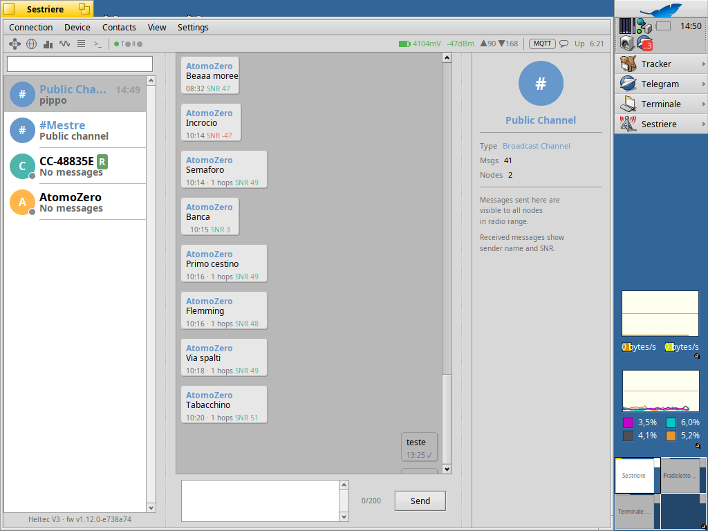
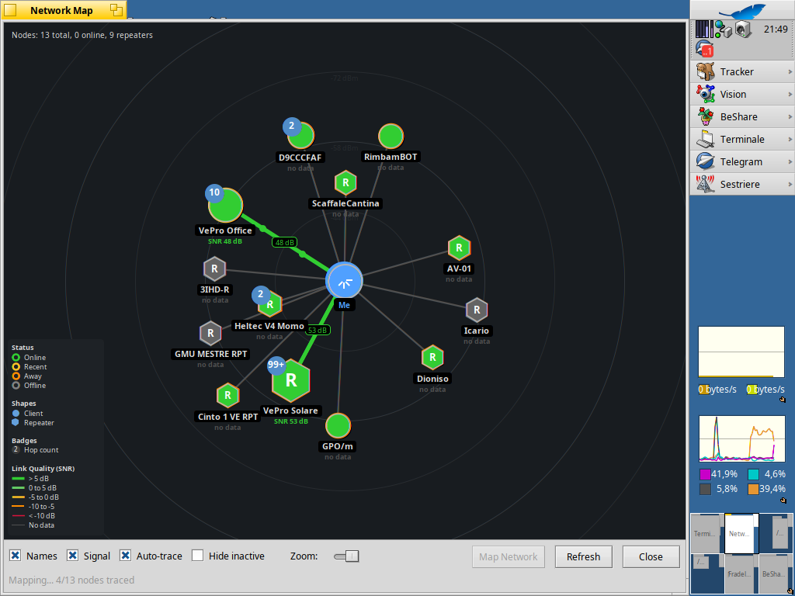
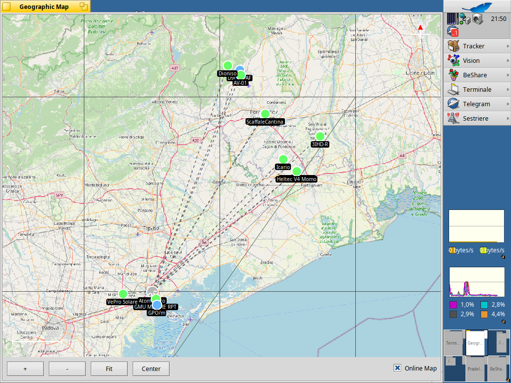
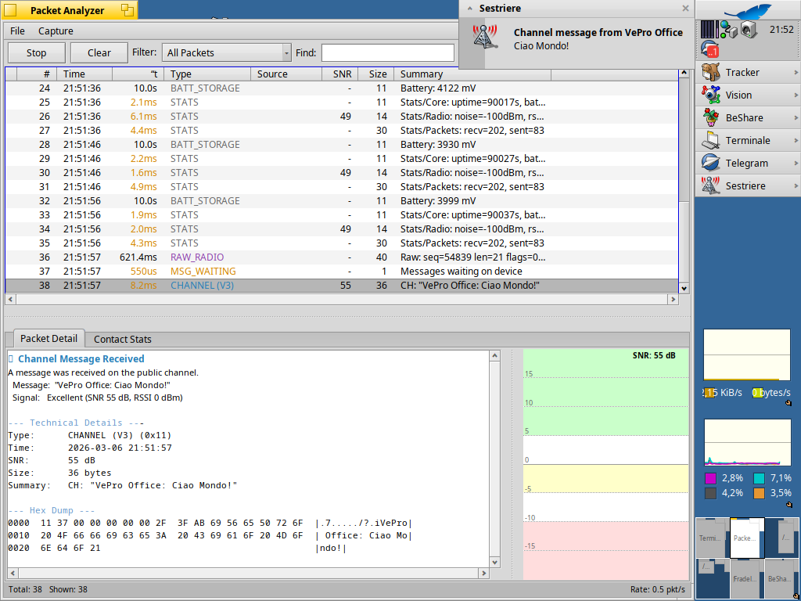
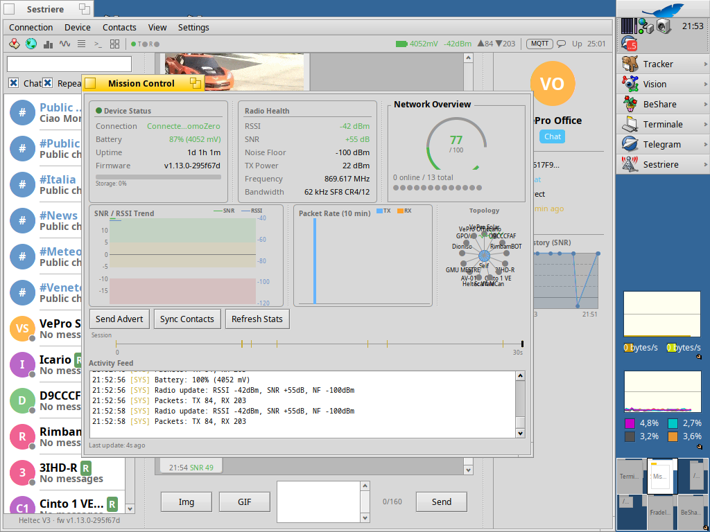

# Sestriere

> Native MeshCore LoRa mesh client for Haiku OS

## Overview

**Sestriere** is a 100% native Haiku OS application that serves as a MeshCore client, communicating with LoRa devices (Heltec v3.2, T-Deck, etc.) via USB serial.

The name recalls the Venetian *sestieri* -- interconnected districts like nodes in a mesh network.

## Screenshots

### Main Window — Chat with GIF, Emoji & Images
3-panel layout with contact sidebar, chat area showing GIF animations, emoji rendering, image sharing, and SNR-annotated bubbles, plus contact info panel with SNR history chart.



### Network Map
Force-directed topology with SNR-colored links, animated flow dots, hop count badges, link quality legend, and full mesh discovery.



### Geographic Map with OSM Tiles
GPS node positions on real OpenStreetMap tiles with offline cache, dashed hop connections, and zoom/pan controls.



### Packet Analyzer
Wireshark-style real-time capture with color-coded packet types, decoded detail view, hex dump, SNR trend chart, and desktop notifications.



### Mission Control Dashboard
Unified dashboard with device status, radio health, network health score arc, SNR/RSSI trend chart, packet rate histogram, mini topology, session timeline, and live activity feed.



## Features

### Core
- **Native Haiku UI** -- Built entirely with Haiku's Be API, fully theme-aware via `ui_color()`
- **USB Serial Communication** -- POSIX-based serial with DTR/RTS support for ESP32 devices
- **SQLite Database** -- Persistent message storage, SNR history, telemetry data
- **Desktop Notifications** -- System notifications for new messages

### Messaging
- **Telegram-style Chat** -- 3-panel layout: contact sidebar, chat area, info panel
- **Chat Bubbles** -- Color-coded with timestamps, SNR indicators, delivery status
- **Direct & Channel Messages** -- Private messages and public broadcast channel
- **Message Search** -- Full-text search across chat history (Cmd+F)
- **Auto-growing Input** -- Multi-line input (1-4 lines), Enter to send, Shift+Enter for newline
- **Contact Management** -- Search, sync, export/import, right-click context menu
- **Contact Type Filters** -- Sidebar checkboxes to show/hide Chat, Repeater, and Room contacts (persistent)
- **Ping with Feedback** -- Round-trip time measurement with results shown directly in chat
- **GIF Sharing** -- GIPHY-powered animated GIF picker, compatible with meshcore-open (`g:ID` format)
- **Emoji Rendering** -- Unicode emoji displayed as PNG sprites with transparent alpha compositing
- **Image Sharing** -- LoRa image transfer with chunked encoding, auto-fetch, and chat integration
- **SAR Markers** -- Search and rescue marker parsing, display in chat and geographic map

### Visualization
- **Network Map** -- Force-directed topology with SNR-colored links, animated flow dots, trace route visualization, auto-trace, full mesh discovery, and edge persistence
- **Geographic Map** -- Lat/lon map with zoom, pan, grid, compass, scale bar, hop-count colored connections, and OSM tile overlay with offline cache
- **Telemetry Dashboard** -- Battery, storage, radio stats graphs with time ranges up to 7 days, CSV export
- **Mission Control** -- Unified dashboard: health score arc, SNR/RSSI trend, packet rate histogram, mini topology, session timeline, activity feed, and alert banners

### Radio Analysis
- **Packet Analyzer** -- Wireshark-style real-time analyzer with color-coded packet types, decoded detail view, hex dump, SNR trend chart, contact heatmap, delta-t timing, CSV export
- **Statistics Window** -- Core/radio/packet stats with auto-refresh
- **Trace Path** -- Graphical route visualization with node cards, colored avatars, arrows, and SNR-colored pills between hops

### Device Control
- **Settings** -- Node name, location, TX power, 12 radio presets (frequency, bandwidth, SF, CR)
- **Repeater Admin** -- Remote administration of repeaters/rooms after login with contextual toolbar in chat area (stats, contacts, reboot, factory reset)
- **Battery & Storage Monitoring** -- Real-time voltage and storage status with LiPo/LiFePO4/NMC chemistry curves
- **Serial Monitor** -- Terminal-style CLI interaction for repeater/standalone devices
- **Repeater Monitor** -- Structured repeater log analysis with per-node stats and topology extraction

### MQTT Integration
- **MQTT Bridge** -- Relay messages to MQTT broker (meshcoreitalia.it)
- **MQTT Log** -- Timestamped connection events and publish reports
- **Auto-reconnect** -- Exponential backoff (5s to 60s)

## Requirements

- Haiku OS R1/beta5 or later
- MeshCore-compatible LoRa device with USB Serial Companion firmware
- USB cable

### Dependencies

```bash
pkgman install mosquitto_devel sqlite_devel curl_devel giflib_devel
```

### USB Serial Driver Note

For Silicon Labs CP210x devices (like Heltec LoRa32 v3.2), you may need the patched USB serial driver. See `HAIKU_USB_SERIAL_FIX.md` for details.

## Building

```bash
cd src
make
./objects.x86_64-cc13-debug/Sestriere
```

### Release Build

```bash
cd src
make OBJ_DIR=release OPTIMIZE=FULL
```

## Usage

1. Connect your MeshCore device via USB
2. Launch Sestriere
3. Select the serial port (typically `/dev/ports/usb0`)
4. Wait for contact sync to complete
5. Select a contact or Public channel to start messaging

### Keyboard Shortcuts

| Shortcut | Action |
|----------|--------|
| Cmd+O | Connect |
| Cmd+D | Disconnect |
| Cmd+R | Sync Contacts |
| Cmd+B | Toggle sidebar |
| Cmd+I | Toggle info panel |
| Cmd+F | Search messages |
| Cmd+M | Network Map |
| Cmd+G | Geographic Map |
| Cmd+L | Debug Log |
| Cmd+S | Statistics |
| Cmd+Y | Telemetry |
| Cmd+Shift+P | Packet Analyzer |
| Cmd+Shift+D | Mission Control |
| Cmd+Shift+M | MQTT Log |

## Supported Hardware

- Heltec LoRa32 v3/v3.2
- LilyGO T-Deck
- LilyGO T-Beam
- RAK WisBlock
- Other MeshCore-compatible devices with USB Serial Companion firmware

## Protocol

Sestriere implements the [MeshCore Companion Radio Protocol](https://github.com/ripplebiz/MeshCore/wiki/Companion-Radio-Protocol) (V3):

- Frame format: `[marker][len_lo][len_hi][payload...]`
- Inbound marker (App -> Radio): `<` (0x3C)
- Outbound marker (Radio -> App): `>` (0x3E)
- All multi-byte values are Little Endian
- Default baud rate: 115200 8N1

V3 adds SNR fields to incoming messages. V2 responses (0x07, 0x08) are also supported for backwards compatibility.

## Project Structure

```
Sestriere/
├── README.md                       # This file
├── HAIKU_USB_SERIAL_FIX.md         # USB driver patch docs
├── img/                            # Screenshots
├── src/                            # Source code
│   ├── Makefile                    # Build system
│   ├── Sestriere.cpp               # BApplication entry point
│   ├── MainWindow.cpp/h            # Main window (UI + event routing)
│   ├── ProtocolHandler.cpp/h       # Protocol parsing (extracted from MainWindow)
│   ├── SerialHandler.cpp/h         # POSIX serial I/O (BLooper)
│   ├── DatabaseManager.cpp/h       # SQLite database (messages, SNR, telemetry, groups)
│   ├── ChatView.cpp/h              # Telegram-style message display
│   ├── ChatHeaderView.cpp/h        # Chat header with contact info
│   ├── MessageView.cpp/h           # Chat bubble rendering
│   ├── ContactItem.cpp/h           # Contact list item with status dots & groups
│   ├── ContactInfoPanel.cpp/h      # Right-side contact detail panel
│   ├── SNRChartView.cpp/h          # SNR history chart
│   ├── AddChannelWindow.cpp/h      # Channel creation dialog
│   ├── TopBarView.cpp/h            # Unified top bar (icons + status)
│   ├── GrowingTextView.cpp/h       # Auto-growing multi-line input
│   ├── SettingsWindow.cpp/h        # Device & Radio settings (12 presets)
│   ├── StatsWindow.cpp/h           # Device statistics display
│   ├── MapView.cpp/h               # Geographic map with zoom/pan/grid
│   ├── NetworkMapWindow.cpp/h      # Force-directed network topology
│   ├── TelemetryWindow.cpp/h       # Sensor dashboard with graphs + CSV
│   ├── PacketAnalyzerWindow.cpp/h  # Wireshark-style packet analyzer
│   ├── MissionControlWindow.cpp/h  # Unified mission control dashboard
│   ├── TracePathWindow.cpp/h       # Route tracing visualization
│   ├── LoginWindow.cpp/h           # Repeater/Room authentication
│   ├── ContactExportWindow.cpp/h   # Contact import/export via clipboard
│   ├── ProfileWindow.cpp/h         # Profile export/import (JSON)
│   ├── SerialMonitorWindow.cpp/h   # Terminal-style serial CLI monitor
│   ├── RepeaterMonitorView.cpp/h   # Structured repeater log viewer (BView)
│   ├── RepeaterMonitorWindow.cpp/h # Repeater monitor window
│   ├── DebugLogWindow.cpp/h        # Raw protocol debug log
│   ├── MqttClient.cpp/h            # MQTT bridge integration
│   ├── MqttLogWindow.cpp/h         # MQTT event log
│   ├── NotificationManager.cpp/h   # Desktop notifications
│   ├── DeskbarReplicant.cpp/h      # Deskbar tray integration
│   ├── GiphyClient.cpp/h           # GIPHY API client (search, trending, download)
│   ├── GifPickerWindow.cpp/h       # Animated GIF picker grid window
│   ├── EmojiRenderer.cpp/h         # Unicode emoji PNG sprite rendering
│   ├── ImageCodec.cpp/h            # Image compression/decompression + GIF frame decode
│   ├── ImageSession.cpp/h          # LoRa chunked image transfer session
│   ├── SarMarker.cpp/h             # SAR marker parsing (meshcore-sar protocol)
│   ├── TileCache.cpp/h             # OSM map tile download and cache
│   ├── CoastlineData.h             # Coastline polygon data for geographic map
│   ├── Types.h                     # Protocol structures & radio presets
│   ├── Constants.h                 # Application constants & thresholds
│   ├── Compat.h                    # BObjectList API compatibility
│   └── Utils.h                     # Shared utilities (FormatUptime, ParseHex, etc.)
└── haiku-patches/                  # USB driver patches
```

## Architecture

```
┌─────────────────────────────────────────────────────┐
│                   Sestriere (BApplication)           │
└─────────────────────────────────────────────────────┘
                          │
    ┌─────────────────────┴─────────────────────┐
    │                                           │
    ▼                                           ▼
┌──────────────────┐                  ┌─────────────────────┐
│  MainWindow      │◄─── BMessage ───►│  SerialHandler      │
│  (BWindow)       │                  │  (BLooper + Thread)  │
└──────────────────┘                  └─────────────────────┘
        │                                       │
        ├─ TopBarView (icons + status)          ▼
        ├─ ContactList (sidebar)      ┌─────────────────────┐
        ├─ ChatView (message bubbles) │  POSIX Serial       │
        ├─ ContactInfoPanel (right)   │  (DTR/RTS enabled)  │
        ├─ DatabaseManager (SQLite)   └─────────────────────┘
        │                                       │
        ├─ SettingsWindow                       ▼
        ├─ NetworkMapWindow           ┌─────────────────────┐
        ├─ MapView (Geographic)       │ MeshCore Device     │
        ├─ TelemetryWindow            │ (Heltec, T-Deck)    │
        ├─ PacketAnalyzerWindow       └─────────────────────┘
        ├─ MissionControlWindow
        ├─ StatsWindow
        ├─ TracePathWindow
        ├─ LoginWindow
        ├─ MqttClient (bridge)
        ├─ MqttLogWindow
        ├─ SerialMonitorWindow
        ├─ RepeaterMonitorWindow
        └─ ProfileWindow
```

## License

MIT License -- See LICENSE file for details.

## Author

Created by **Andrea Bernardi**.

## Acknowledgments

- [MeshCore](https://github.com/meshcore-dev/MeshCore) -- The mesh networking firmware
- [Haiku OS](https://www.haiku-os.org/) -- The operating system
- [Haiku API](https://api.haiku-os.org/) -- Native API documentation

## References

- [MeshCore Companion Radio Protocol](https://github.com/meshcore-dev/MeshCore/wiki/Companion-Radio-Protocol)
- [Haiku Coding Guidelines](https://www.haiku-os.org/development/coding-guidelines/)
