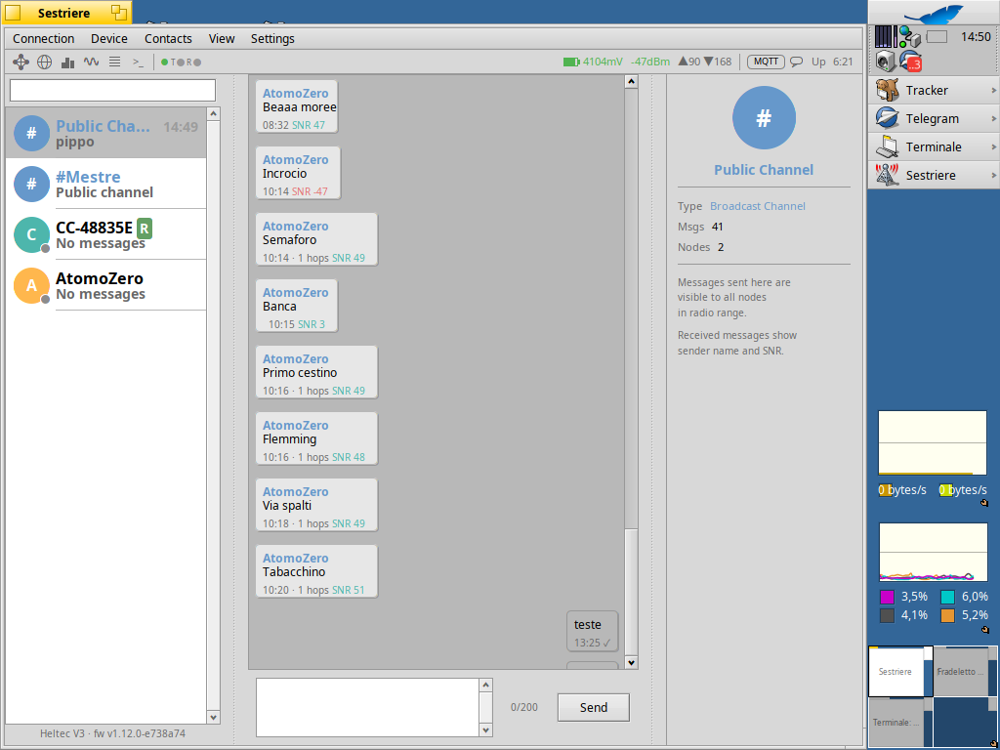

# Sestriere for Haiku

Native Haiku client for the MeshCore LoRa mesh network: send messages, voice clips, images, and GIFs over LoRa with any device running MeshCore, without internet and without third-party servers.



If Sestriere for Haiku saves you time, consider supporting development: [](https://buymeacoffee.com/atomozero)


## Features

* Native Haiku GUI built entirely with BeAPI
* Full MeshCore Companion Radio Protocol V3 support (94/94 codes)
* Direct messages with SMAZ compression and end-to-end encryption
* Channels, repeaters, and rooms unified in a single sidebar
* Multi-companion support: switch USB devices without losing data
* Image sharing via color WebP with auto-fetch of missing fragments
* Voice messages with Codec2 encoding (30s push-to-talk)
* Animated GIFs via GIPHY, compatible with meshcore-open
* Emoji reactions compatible with meshcore-open
* SAR markers for search-and-rescue, shown in chat and on the map
* Network topology map with SNR-colored links and animated packet flow
* Geographic OSM map with 50MB tile cache and bulk area download
* Line-of-Sight analysis with Fresnel zone and earth curvature
* Mission Control dashboard with health arc, trends, and timeline
* MQTT bridge to publish status and packets to external brokers
* Packet Analyzer with color-coded protocol frame breakdown
* Telemetry dashboard with time ranges from 1m to 7d
* Admin login on repeaters and rooms with concurrent sessions
* Color-coded debug log split by command semantics
* Localized for international use
* No external dependencies beyond Haiku system libraries, SQLite,
  Mosquitto, libcurl, giflib, and Codec2

## Quick start

### Connect a LoRa device

Plug a Heltec v3.2, T-Deck, or any MeshCore-compatible LoRa board via
USB. Sestriere auto-detects the serial port and connects with three
retry attempts.

For Silicon Labs CP210x chips you may need a patched USB serial driver,
see [`docs/HAIKU_USB_SERIAL_FIX.md`](docs/HAIKU_USB_SERIAL_FIX.md).

### Send a message

```
cd src
make -j4
./objects.x86_64-cc13-debug/Sestriere
```

The main window shows three panels: contacts on the left, chat in the
middle, info panel on the right. Pick a contact and type. Voice clips,
GIFs, and images go through the buttons next to the input field.

### Channels

Public channel auto-joins with the well-known PSK. Add custom channels
from the **Channels** menu: choose **Create private** (random PSK),
**Join private** (paste hex PSK), or **Join hashtag** (PSK derived from
SHA-256 of the name).

### Admin login

Right-click a repeater or room contact and choose **Login**. The admin
toolbar appears in the chat header, with quick buttons for version,
neighbors, clock, clear stats, reboot, and factory reset.

## Build

Dependencies (install via `pkgman`):

```
pkgman install mosquitto_devel sqlite_devel curl_devel giflib_devel
```

Codec2 must be built from source to `/boot/system/non-packaged`.

Main app:

```
cd src
make -j4              # debug build → objects.x86_64-cc13-debug/Sestriere
make OBJ_DIR=release OPTIMIZE=FULL   # release build
```

Companion apps (radio simulator and repeater log analyzer):

```
cd fake_radio && make -j4
cd repeater_monitor && make -j4
```

Tests:

```
cd src/tests
./run_tests.sh        # runs all tests
./run_tests.sh phase  # filter by name pattern
```

## Documentation

- [`docs/MANUAL.md`](docs/MANUAL.md) — user manual
- [`docs/ROADMAP.md`](docs/ROADMAP.md) — feature status and development plan
- [`docs/HAIKU_USB_SERIAL_FIX.md`](docs/HAIKU_USB_SERIAL_FIX.md) — USB driver patch
- [`docs/changelog/`](docs/changelog/) — per-version changelogs

## Be careful

> **Developer's Note**: This software may contain traces of peanuts and LLM. It has been developed with passion for the Haiku platform and the MeshCore community.

## Support

If you find this project useful, you can buy me a coffee: [](https://buymeacoffee.com/atomozero)
