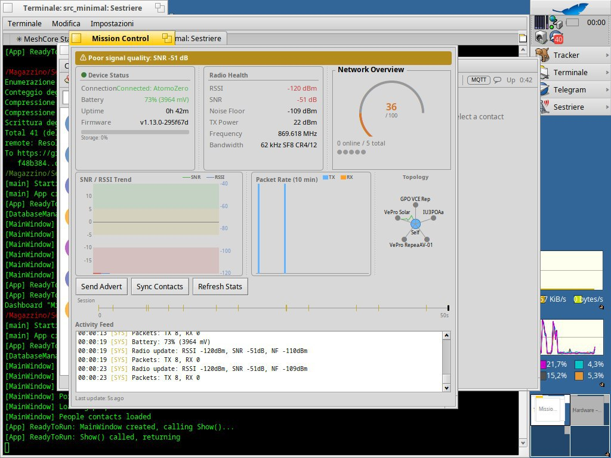

# Sestriere Minimal

> Lightweight MeshCore LoRa client for Haiku OS

## Overview

**Sestriere Minimal** is a streamlined version of the Sestriere MeshCore client, focused on essential messaging and radio analysis features with a Telegram-style user interface.

## Screenshots




## Features

### Messaging
- **Telegram-style UI** — 3-panel layout: contact sidebar, chat area, info panel
- **Contact List** — Avatar initials, last message preview, timestamps, unread badges
- **Contact Search** — Real-time filter bar at top of sidebar (case-insensitive)
- **Auto-growing Input** — Multi-line message input (1-4 lines), Enter to send, Shift+Enter for newline
- **Chat Bubbles** — WhatsApp/iMessage-style message display with sender colors
- **Direct Messages** — Send and receive private messages to contacts
- **Channel Messages** — Public broadcast channel support
- **Desktop Notifications** — System notifications for new messages
- **Message Persistence** — Messages saved to ~/config/settings/Sestriere/

### Network Visualization
- **Network Map** — Interactive visualization of mesh network (View → Network Map)
  - Circular layout with your node at center
  - Contact nodes with signal strength indicators
  - Repeater detection (hexagonal shape)
  - Room server identification
  - Online/offline status (5-minute timeout)
  - Animated pulses on network activity
  - Click nodes for detailed info panel

### MQTT Integration (meshcore-to-maps)
- **Broker Connection** — Connect to meshcoreitalia.it central broker
- **Status Publishing** — Periodic status updates (every 60 seconds)
- **Packet Reporting** — Report received packets for network analysis
- **GPS Position** — Configure latitude/longitude for map display
- **Observer Mode** — Act as network observer for mesh mapping
- **Status Indicator** — MQTT connection status in status bar

### Radio Analysis
- **Statistics Window** — Real-time device statistics (View → Statistics)
  - Core: Uptime, TX/RX packets, bytes, routed/dropped packets
  - Radio: RSSI, SNR, TX/RX time, channel busy %, CRC errors
  - Packets: Adverts, messages, ACKs sent/received
  - Auto-refresh every 5 seconds

- **Trace Path** — Route visualization to contacts
  - Hop-by-hop path display
  - SNR quality indicators per hop
  - Node names and public key prefixes

- **Raw Packet Logging** — 0x88 radio packet analysis
  - Packet counting and statistics
  - Sequence numbers and flags
  - Periodic logging (every 10 packets or 5 seconds)

- **Debug Log Window** — Complete protocol traffic (View → Debug Log)
  - TX/RX frame hex dumps
  - Protocol message parsing
  - Timestamped entries

### Device Control
- **Connection** — USB serial via File → Connect
- **Sync Contacts** — Device → Sync Contacts
- **Send Advertisement** — Device → Send Advertisement
- **Device Info** — Device → Device Info
- **Battery Status** — Device → Battery Status

### Top Bar
Unified 32px bar with hamburger menu and real-time status:
- Connection indicator (green/red dot)
- Battery voltage with color coding
- RSSI and SNR indicators
- TX/RX packet counters
- Device uptime
- **MQTT status** (ON/OFF indicator)

### Contact Info Panel
Collapsible right-side panel (Cmd+I) showing:
- Contact avatar and name
- Node type badge (colored)
- Public key prefix
- Path length (hops or direct)
- Last seen time with age-based coloring

## Building

### Requirements
- Haiku OS (x86_64)
- GCC compiler
- libmosquitto (for MQTT support)

### Install Dependencies
```bash
pkgman install mosquitto_devel
```

### Build
```bash
cd src_minimal
make
./objects.x86_64-cc13-debug/Sestriere
```

### Release Build
```bash
make OBJ_DIR=release OPTIMIZE=FULL
```

## Usage

1. Connect MeshCore device via USB
2. File → Connect (Cmd+O)
3. Wait for connection confirmation in status bar
4. Device → Sync Contacts (Cmd+R) to load contacts
5. Select "Public Channel" or a contact to start messaging
6. Type message and press Send or Enter

### MQTT Setup (for meshcore-to-maps)

1. View → MQTT Settings
2. Enable MQTT
3. Set your GPS coordinates (latitude, longitude)
4. Set IATA code (airport code for your region, e.g., VCE, FCO, MXP)
5. Click Apply
6. Status bar will show "MQTT: ON" when connected

### Keyboard Shortcuts

| Shortcut | Action |
|----------|--------|
| Cmd+O | Connect |
| Cmd+D | Disconnect |
| Cmd+R | Sync Contacts |
| Cmd+A | Send Advertisement |
| Cmd+L | Debug Log |
| Cmd+S | Statistics |
| Cmd+M | Network Map |
| Cmd+B | Toggle Sidebar |
| Cmd+I | Toggle Info Panel |
| Cmd+Q | Quit |

## Protocol Notes

### Channel Message Format
Channel messages use a simplified format:
```
[0]   = 0x08 (RSP_CHANNEL_MSG_RECV)
[1]   = channel_idx
[2-3] = padding
[4-7] = timestamp (uint32 LE)
[8+]  = text (includes "SenderName: message")
```

### Direct Message Format
```
[0]   = 0x07 (RSP_CONTACT_MSG_RECV)
[1-6] = sender pubkey prefix
[7]   = path_len (0xFF = direct)
[8]   = txt_type
[9-12] = timestamp (uint32 LE)
[13+] = text
```

### MQTT Topics
```
meshcore/{IATA}/{PUBLIC_KEY}/status   - Device status updates
meshcore/{IATA}/{PUBLIC_KEY}/packets  - Received packet reports
```

### SNR Values
SNR is transmitted as `value * 4`. Display as `snr / 4.0` for dB.

Quality indicators:
- `[++]` ≥ 10 dB (Excellent)
- `[+ ]` ≥ 5 dB (Good)
- `[  ]` ≥ 0 dB (Fair)
- `[ -]` ≥ -5 dB (Poor)
- `[--]` < -5 dB (Bad)

## File Structure

```
src_minimal/
├── Makefile
├── README.md                   # This file
├── Constants.h                 # Protocol constants
├── Types.h                     # Data structures
├── Sestriere.cpp               # BApplication entry point
├── MainWindow.cpp/h            # Main window with 3-panel layout
├── SerialHandler.cpp/h         # USB serial communication
├── ChatView.cpp/h              # Message list display
├── ChatHeaderView.cpp/h        # Chat area header
├── MessageView.cpp/h           # Chat bubble rendering
├── ContactItem.cpp/h           # Compact contact list item
├── TopBarView.cpp/h            # Unified top bar (menu + status)
├── ContactInfoPanel.cpp/h      # Right-side contact detail panel
├── GrowingTextView.cpp/h       # Auto-growing multi-line input
├── NotificationManager.cpp/h   # Desktop notifications
├── DebugLogWindow.cpp/h        # Debug log window
├── SettingsWindow.cpp/h        # Settings (Radio + MQTT tabs)
├── StatsWindow.cpp/h           # Statistics window
├── TracePathWindow.cpp/h       # Trace path window
├── TelemetryWindow.cpp/h       # Telemetry dashboard
├── NetworkMapWindow.cpp/h      # Network visualization
├── MapView.cpp/h               # Geographic map view
├── LoginWindow.cpp/h           # Remote login dialog
├── ContactExportWindow.cpp/h   # Contact export dialog
├── MqttClient.cpp/h            # MQTT client (libmosquitto)
├── MqttSettingsWindow.cpp/h    # MQTT configuration (legacy)
└── DeskbarReplicant.cpp/h      # Deskbar integration
```

## Feature Comparison

| Feature | Full | Minimal |
|---------|------|---------|
| Telegram-style UI | — | ✓ |
| Network Map | — | ✓ |
| MQTT Integration | — | ✓ |
| Statistics Window | ✓ | ✓ |
| Trace Path | ✓ | ✓ |
| Raw Packet Analysis | — | ✓ |
| Debug Log Window | ✓ | ✓ |
| Desktop Notifications | ✓ | ✓ |
| Message Persistence | ✓ | ✓ |
| Top Bar (menu + status) | — | ✓ |
| Contact Info Panel | — | ✓ |
| Contact Search | — | ✓ |
| Multi-line Input | — | ✓ |
| Map View (full) | ✓ | — |
| Mesh Graph | ✓ | — |
| Telemetry Dashboard | ✓ | — |

## Credits

- MeshCore protocol by the MeshCore team
- MQTT integration compatible with [meshcore-to-maps](https://github.com/xpinguinx/meshcore-to-maps)
- Built for Haiku OS using the Be API

## License

MIT License

Copyright (c) 2025 Sestriere Authors
